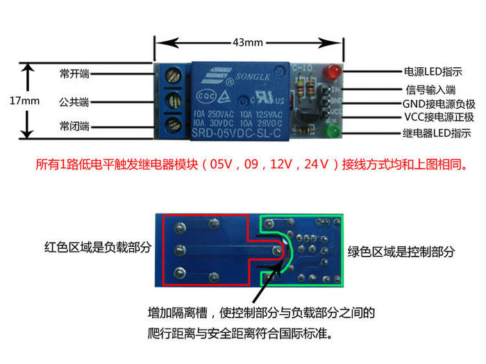
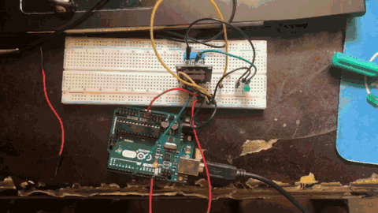

# 2018大创项目智能插座

我负责的Arduino硬件部分


### Arduino的使用

由于要做智能开关，所以需要使用arduino

* 使用arduino控制继电器的方法

  ```c
  int jidianqi = 8;
  
  void setup(){
      //安装函数在第一次运行时执行
   pinMode(jidianqi, OUTPUT); 
      //pinMode设置引脚
  }
  
  void loop(){
      //循环函数一直循环
    digitalWrite(jidianqi, HIGH);
      //digitalWrite写入高低电平
      //digitalRead()是读取高低电平，返回一个high or low
    delay(2000);
      //持续两秒
    digitalWrite(jidianqi, LOW); //LOW to poweroff the LED light on jidianqi
    delay(5000);
  }
  ```

  

* 树莓派的使用

  ```python
  import serial 
  	#对树莓派进行操作库
  import urllib2
  	#网络请求库
  import json
  	#解析和发送json字段
  
  hostname = 'http://你的地址/dachuang/api/v1/allHardware'
  # /dev/ttyACM0 是树莓派上编号为0的USB口（可以在/dev目录下通过观察拔插对应的USB口找到对应的编号）					
  ser = serial.Serial('/dev/ttyACM0', 9600, timeout = 4)
  
  while 1:
      r = urllib2.Request(hostname)
      r = urllib2.urlopen(r)
      res = r.read()
      result = json.loads(res)
      print result
      send = ''
      # 通过json库解析完后的数据就是字典
      if result[0]['status'] == 1:
          send += 'a'
      else:
          send += 'A'
      if result[1]['status'] == 1:
      send += 'b'
      else:
      send += 'B'
      # 从下位机Arduino上读取到的数据拼接URL发送回服务器，更新数据库
      ser.write(send)
      response = ser.readall()
      if '' != response:
          response = response[0:2]
          ret = urllib2.Request("http://你的地址/dachuang/api/v1/updateHardware?hardwarename=tempUnit&status=3" + '&num=' + response)
          ret = urllib2.urlopen(ret)
  ```

  #### 操作流程

  ```
  a -> “开灯”
  A -> “关灯”
  b -> “开风扇”
  B -> “关风扇”
  ```

大概了解了一下，具体的还需等到继电器到，开始操作！

---


### 继电器控制led小灯

继电器的原理高中物理学过，所以明白原理的话，其实很好操作。


首先我们把继电器之前的线连好，连线的方式是：

```
继电器可以直接插入面包板中方便使用

GND->GND

VCC->5V（5v可以插在面包板上的正极区域，然后整个区域都会施加5v的电压）

信号输入端->8口（控制继电器的口）
```
继电器与小灯的连线：

```
常开端和公共端连进电路，记得中间要放一个电阻，否则led小灯会被烧坏！
```

完成图：



观察到继电器通电小灯亮，如果有声音可以听到继电器开闭时的“啪”的一声。
