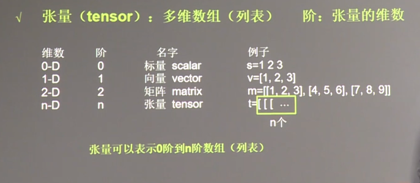

# tensorflow入门

首先是一个最简单的例子（可见[python1.py](python1.py)）
```python
#导入包
import tensorflow as tf
import numpy as np

#创建数据
x_data = np.random.rand(100).astype(np.float32) #生成100个随机数列，tensorflow的数据大部分是float32
y_data =x_data*0.1 + 0.3 # W(Weights) = 0.1 , b(biases) =0.3

###创建tensorflow结构开始###
Weights = tf.Variable(tf.random_uniform([1],-1.0,1.0)) #Weights初始化为-1到1的一个随机数
biases = tf.Variable(tf.zeros([1])) #biases初始化为0

y = Weights*x_data +biases

loss = tf.reduce_mean(tf.square(y-y_data))
#tf.reduce_mean的意思是根据后面的axis(坐标轴)求平均值，0代表纵轴，1代表横轴，如果不设axis，则是求所有的平均值
optimizer = tf.train.GradientDescentOptimizer(0.5)
#优化器是以0.5的学习率梯度下降
train = optimizer.minimize(loss)
#将优化器用于误差值

init = tf.initialize_all_variables() #初始化
###创建tensorflow结构结束###

sess = tf.Session()
sess.run(init)  #非常重要

for step in range(401):
    sess.run(train)
    if step % 20 == 0:
        print(step,sess.run(Weights),sess.run(biases))
```
---
## Session(会话控制)
[源码](session_exmple.py)

tensorflow的session会话框有两种模式(建议用with...as,可以用完即关)
流程：
* 定义session
* session.run()
* 操作
* session.close()

```python
#method 1
sess = tf.Session()
result = sess.run(product)
print(result)
sess.close()


#method 2
with tf.Session() as sess:
    result2 = sess.run(product)
    print(result2)
```
---
## Variable(变量)

[源码](session_exmple.py)
### 要点：

1. tensorflow类型的变量用tf.variable( )定义,定义至少需要值和name
2. 用tf.initialize_all_variables( )初始化,并且在会话开始时需要sess.run()一下
3. 给变量赋值使用tf.assign(a,b) 把b付给a

```python
import tensorflow as tf

state = tf.Variable(0,name = 'counter') #定义counter = 0
#print(state.name)
one = tf.constant(1)    #定义常量1

new_value = tf.add(state, one)
update = tf.assign(state, new_value) #把new_value赋给state

init = tf.initialize_all_variables()    #非常重要，初始化变量

with tf.Session() as sess:
    sess.run(init)
    for _ in range(3):
        sess.run(update)
        print(sess.run(state))
```
---
## placeholder(输入)

* placeholder作用是在sess.run()的时候进行输入

* 输入格式是一个python字典格式
```python
import tensorflow as tf

input1 = tf.placeholder(tf.float32)
input2 = tf.placeholder(tf.float32)

output = tf.multiply(input1, input2)

with tf.Session() as sess:
    print(sess.run(output,feed_dict={input1:[7.],input2:[2.]}))
    #placeholder作用是在sess.run()的时候进行输入
    #输入格式是一个python字典格式
```
# tensor

张量(tensor)可以表示0阶到n阶数组



把tensor打印出来

显示为：

Tensor("add:0",shape=(2,),dtype=float32)

* add:0是tensor0的名字
* shape=(2,)表示一维数组长度为2，例如，shape=(2,1)表示二维数组，长2宽1
* dtype是数据类型，tensorflow一般的数据类型为tf.float32,tf.int32...


在这个例子中，计算图只描述了计算的意义，而没有显示计算结果，这是计算图的普遍规律。

计算图（graph）:搭建神经网络的计算过程，只搭建不运算

会话(Session):执行计算图中的节点运算。


神经网络的参数是指神经元线上的权重w。


